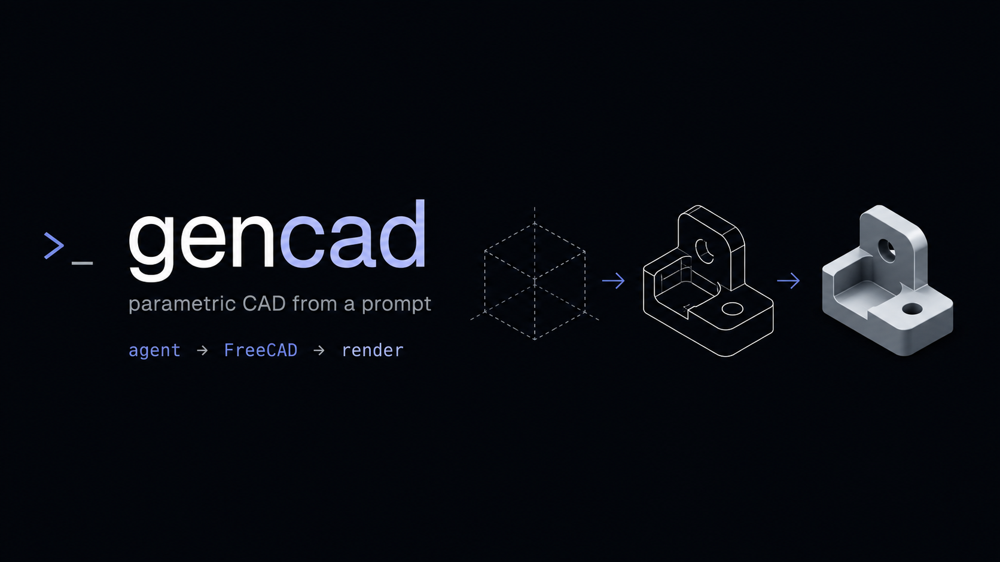

# gencad



**Parametric CAD from a prompt** — headless FreeCAD wired to a coding agent
over MCP, plus the render tooling that lets the agent *see* what it modeled.

An LLM can write solid FreeCAD Python, but generative CAD only converges when
the loop is closed: build the solid, render it, look at the render, fix the
script, repeat. gencad packages that loop:

```
agent ──(MCP)──▶ gencad server ──▶ freecadcmd (FreeCAD headless)
  ▲                                        │
  └──── section render PNGs ◀──────────────┘
```

## What's here

- **`server/gencad_mcp.py`** — a zero-dependency MCP server (stdlib only,
  stdio transport) exposing two tools:
  - `freecad_run` — execute a parametric build script inside `freecadcmd`
  - `freecad_render_section` — slice any solid in a `.FCStd` with a plane and
    render a filled cross-section PNG (material vs. void by containment
    parity), so hole patterns, wall thicknesses and debossed text can be
    visually verified before anything is printed
- **`tools/render_section.py`** — the renderer itself; also usable standalone
  inside `freecadcmd`
- **`text-to-cad/`** — vendored from
  [earthtojake/text-to-cad](https://github.com/earthtojake/text-to-cad)
  (release 0.4.19, MIT), which gencad builds on as its base: a library of
  agent skills for CAD, CAE and CAM — generation with STEP/STL/3MF export, a
  local CAD Viewer, DXF drawings, robot descriptions, G-code slicing, part
  sourcing, and more. How the vendoring, upstream sync, and local patches
  work: [docs/vendoring.md](docs/vendoring.md)
- **`scan2cad/`** — the scan side of the loop: a screen-reader-native
  describe-and-draft CLI. A phone-scanned mesh goes in; out come a
  plain-language geometry report, an editable build123d script with named,
  uncertainty-tagged dimensions, and STEP reference surfaces. The scan is the
  draft, the caliper is the truth. Own venv and own README:
  [scan2cad/](scan2cad/)

## Setup

1. Install [FreeCAD](https://www.freecad.org) (the app bundles Python with
   numpy + matplotlib — no pip installs needed).
2. Register the server with your agent. For Claude Code, add to `.mcp.json`:

```json
{
  "mcpServers": {
    "gencad": {
      "command": "python3",
      "args": ["/path/to/gencad/server/gencad_mcp.py"]
    }
  }
}
```

If `freecadcmd` isn't at the macOS default path, set `GENCAD_FREECADCMD`.

### CAD Viewer

The vendored Viewer serves browser previews of STEP/STL/GLB/URDF and friends
on port 3245. Its CAD backend needs a Python with OCP + build123d + cadgen —
one-time setup, then launch:

```bash
uv venv --python 3.12 .venv-viewer
uv pip install --python .venv-viewer/bin/python cadgen==0.4.19

cd text-to-cad/skills/cad-viewer
VIEWER_CAD_PYTHON=$PWD/../../../.venv-viewer/bin/python \
  npm --prefix scripts/viewer run start -- --host 127.0.0.1
```

Then open `http://127.0.0.1:3245/<absolute model dir>?file=<model>` — e.g.
`http://127.0.0.1:3245/Users/you/gencad/models?file=part.step`.

## Built with this loop: the claude-pet case

The enclosure for [claude-pet](https://github.com/gurul/claude-pet) — an
ESP32-S3 desk buddy around the Freenove display board — is parametric FreeCAD
Python authored and iterated exactly this way; the scripts live in that repo's
[`case/`](https://github.com/gurul/claude-pet/tree/main/case) directory.


Details the build/render/inspect loop carried: PCB-seating bosses biased
0.3 mm short of the derived board plane for preload, blind Ø4.0 × 6.8 mm bores
for M3 heat-set inserts, front-entry countersunk screws riding D-trimmed guide
standoffs through the PCB holes, a WS2812 glow window with BOOT/RESET
pokeholes — and a 1.2 mm "gauge" plate carrying just the board's hole grid, so
the footprint gets test-printed and verified against the physical PCB before
committing to full shells.

## License

MIT
